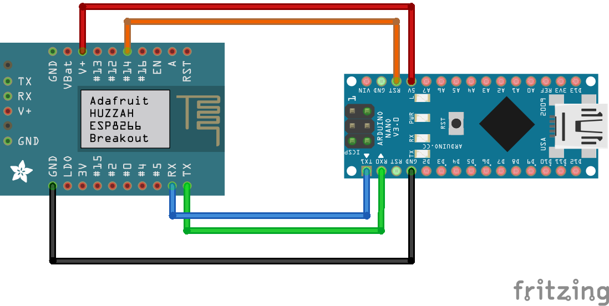
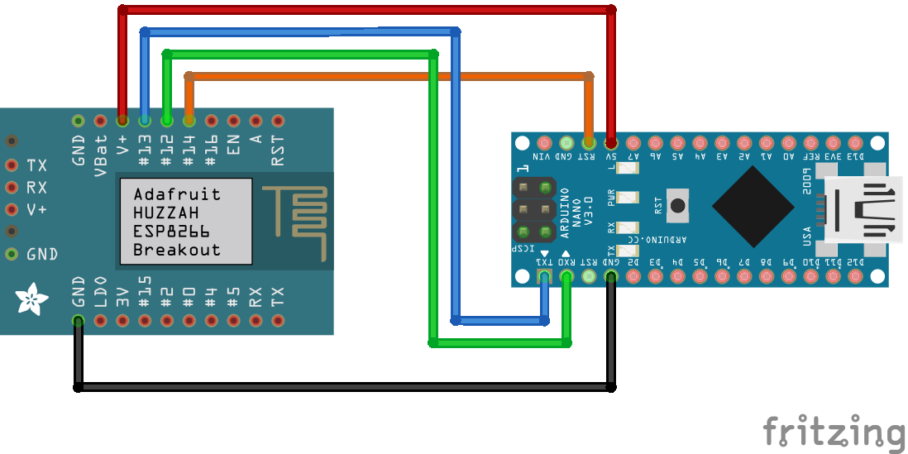

# Bienvenue Serial

"Bienvenue Serial" is a bridge between WLAN and serial port running on ESP8266. I have developed it to be able to address a Woodpecker CNC control via WLAN. However, it should also be able to address other circuits via the RxTx interface.

## Installation

The project is based on [PlatformIO](https://platformio.org). You can build and upload the executable with:

	platformio run --target upload
	
## Configuration

If you connect to the microcontroller via the default serial port (default baud rate is 115200), you can change the settings. The settings appear automatically if the microcontroller cannot connect to the WLAN during initialization. You can also set a pin (mode pin) that changes the program to settings mode when its level changes. If the standard pins for the serial port are not used, you can also send the character "x" via the standard serial port to switch to the settings mode.

The settings show an overview of all parameters:

    s) SSID        : WLAN
    P) Password    : ******
    o) Mode Pin    : 14
    m) mDNS Service: cnc
    p) Port        : 2345
    b) Baud        : 115200
    r) RX          : 13              t) TX          : 12
    1) DTR         : 15              2) DSR         : -1
    3) RTS         : -1              4) CTS         : -1
    q) Quit   C) Check WLAN   R) Read   W) Write   X) Clear
    
Press the key with the character in front of a setting to change its value. There are the following parameters:

* SSID and password: The name and the password of the wlan to which the program should connect.
* Mode Pin: When a level change occurs at this pin, the program switches to the setting mode (-1 means: do not use).
* mDNS Service: The service name for mDNS.
* Port: The TCP/IP port for WLAN connections.
* Baud: The baud rate of the serial port.
* RX, TX, DTR, DSR, RTS, CTS: The pins used for the corresponding serial signals (-1 means: do not use). DSR, RTS, and CTS are not supported yet.

The last row in the settings overview contains some function keys:

* q) Quit the settings
* C) Try to connect to the WLAN, and return to the settings
* R) Discard all changes, and reload the settings from EEPROM.
* W) Check WLAN and if successful write current settings to EEPROM.
* X) Reset all parameters to factory settings.

## Serial connection

For the serial connection you have to connect the Rx pin of the ESP8266 with the Tx pin of the terminal device and vice versa.

  

For the settings shown above, the circuit looks like this:

  

### Use of the DTR signal

The DTR signal can be used to reset the end device (e.g. the CNC control) before the connection is established. To do this, you must connect the pin to which the DTR signal is sent to the reset pin of the end device.

## Peer to peer connections

The program connects to a WLAN access point and makes its service available on the WLAN. In addition, the code already contains preparations for peer-to-peer connections. However, this part of the code has not been tested yet and is not operational.

## License

Copyright 2021 macoonshine

Licensed under the Apache License, Version 2.0 (the "License");
you may not use this file except in compliance with the License.
You may obtain a copy of the License at

[http://www.apache.org/licenses/LICENSE-2.0](http://www.apache.org/licenses/LICENSE-2.0)

Unless required by applicable law or agreed to in writing, software
distributed under the License is distributed on an "AS IS" BASIS,
WITHOUT WARRANTIES OR CONDITIONS OF ANY KIND, either express or implied.
See the License for the specific language governing permissions and
limitations under the License.
